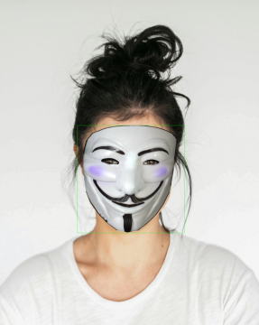

<div align="center">

  # Real-Time AI-based Virtual Mask Filter 🎭

</div>

An AI-powered application that overlays virtual masks onto users' faces in real time. The app first detect your face on input video with a bounding box and keypoints. Then, a chosen mask (e.g., anonymous, squidgame man) will be applied on your face 

<p align="center"> 
    
    
</p>

<p align="center"> 
    
    
</p>


## 📌 Features
- Real-time face detection and landmark recognition.
- Applies virtual masks with precise alignment.
- Works efficiently on both desktop and mobile devices.
- Optimized for performance using deep learning techniques.

## 🔍 How It Works  
The application follows a structured pipeline to process and enhance facial images effectively:  

1. **Face Detection**: Leverages both `OpenCV’s Deep Learning-based Face Detector` and `MediaPipe Face Detection` for accurate and efficient face recognition in images and videos.  
2. **Facial Landmark Detection**: Uses a pre-trained **EfficientNet** model with **transfer learning** to detect **68 facial landmarks**.  
3. **Face Alignment**: Employs the **Delaunay Triangulation algorithm** to align facial features for precise transformations.  
4. **Filter Application**: Once aligned, various filters—such as beauty enhancements, cartoon effects, or virtual masks—can be applied dynamically.  


## 🛠 Key Technologies Used
- **Python**
- **PyTorch** - for deep learning models
- **OpenCV** - for image processing
- **EfficientNetB0** - for facial landmark detection
- **Delaunay Triangulation** - for accurate mask mapping

## 🚀 Installation
Follow these steps to set up the project:

```bash
# Clone the repository
git clone https://github.com/Lhhiep-maxcode/Filter.git
cd Filter

# Create a virtual environment (optional but recommended)
python -m venv env
source env/bin/activate  # On Windows use: env\Scripts\activate

# Install dependencies
pip install -r requirements.txt
```

## 🌟 Running the Application  
After setting up the environment, open the `Face detection.ipynb` file and execute all the cells. Once completed, you’ll see impressive results as demonstrated in the introduction. 🚀
